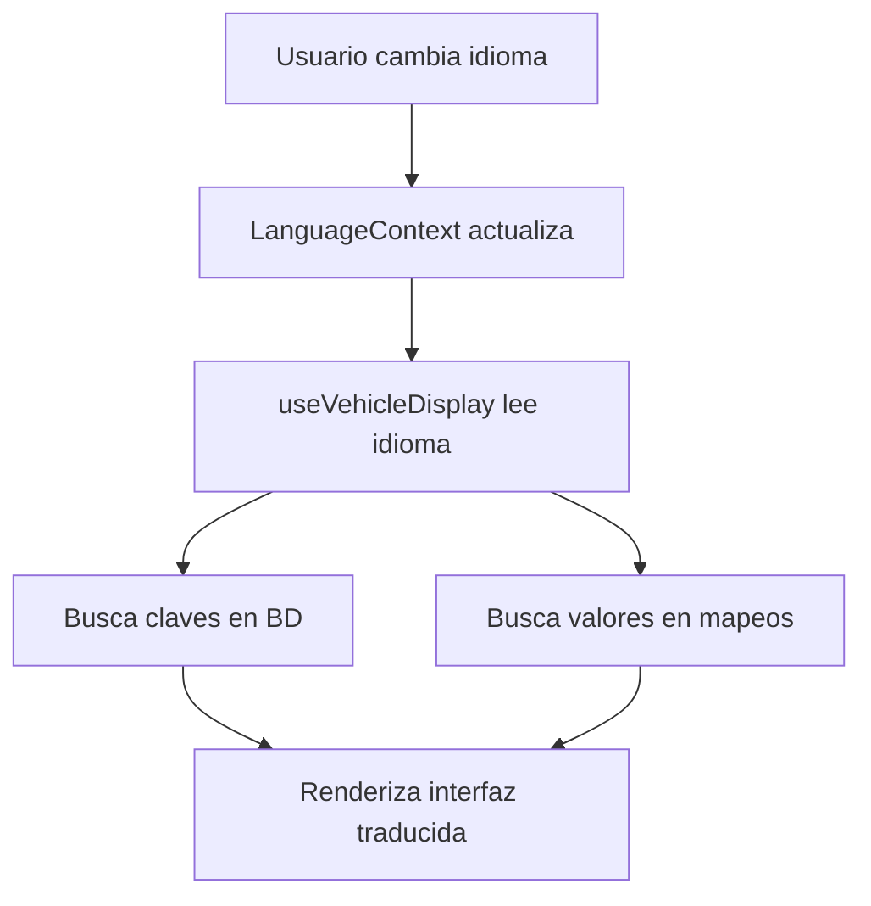

# 🌍 Sistema de Traducciones de Vehículos - Documentación Completa

## 📋 Tabla de Contenidos
1. [Resumen del Sistema](#resumen-del-sistema)
2. [Diferencia entre Claves y Valores](#diferencia-entre-claves-y-valores)
3. [Arquitectura](#arquitectura)
4. [Uso Práctico](#uso-práctico)
5. [Administración](#administración)
6. [Extensión del Sistema](#extensión-del-sistema)
7. [Troubleshooting](#troubleshooting)

## 🎯 Resumen del Sistema

### **¿Qué hace?**
Traduce automáticamente toda la interfaz de vehículos a 4 idiomas:
- **🇦🇩 Catalán (CA)** - Idioma principal
- **🇪🇸 Español (ES)**
- **🇬🇧 Inglés (EN)**  
- **🇫🇷 Francés (FR)**

### **¿Qué traduce?**
- ✅ **Etiquetas** (Marca, Modelo, Potencia, etc.)
- ✅ **Valores de datos** (cotxe → Coche/Car/Voiture)
- ✅ **Estados** (nou → Nuevo/New/Neuf)
- ✅ **Valores booleanos** (true → Sí/Yes/Oui)

---

## 🔑 Diferencia entre Claves y Valores

### **🏷️ CLAVES (Labels)**
Son las **etiquetas** que se muestran al usuario para describir campos.

```typescript
// Ejemplos de claves:
"Marca" → vehicleLabels.brand
"Modelo" → vehicleLabels.model  
"Potencia" → vehicleLabels.power
"Combustible" → vehicleLabels.fuelType
```

**📍 Ubicación**: Base de datos → tabla `VehicleTranslation`  
**📍 Gestión**: Panel de administración  
**📍 Hook**: `useVehicleTranslations()`

### **💾 VALORES (Data)**
Son los **datos** almacenados en la base de datos que necesitan traducirse.

```typescript
// Ejemplos de valores:
"cotxe" → "Coche" / "Car" / "Voiture"
"benzina" → "Gasolina" / "Gasoline" / "Essence"  
"manual" → "Manual" / "Manual" / "Manuelle"
"nou" → "Nuevo" / "New" / "Neuf"
```

**📍 Ubicación**: Código → archivo `vehicleValueMappings.ts`  
**📍 Gestión**: Modificación manual del código  
**📍 Hook**: `useVehicleDisplay()`

---

## 🏗️ Arquitectura

### **📁 Estructura de Archivos**

```
src/
├── hooks/
│   ├── useVehicleTranslations.ts    # Claves/Labels
│   └── useVehicleDisplay.ts         # Hook unificado
├── utils/
│   └── vehicleValueMappings.ts      # Valores/Data
├── context/
│   └── LanguageContext.tsx          # Sistema base de idiomas
└── components/Admin/
    ├── AdminSettings.tsx            # Panel principal
    └── VehicleTranslationForm.tsx   # Formulario de traducciones
```

### **🗄️ Base de Datos**

```sql
-- Tabla para claves/labels
VehicleTranslation {
  id: String
  key: String         -- "vehicle.power"
  category: String    -- "technical"
  ca: String         -- "Potència" 
  es: String         -- "Potencia"
  en: String         -- "Power"
  fr: String         -- "Puissance"
  description: String -- "Potencia del vehículo en CV"
}
```

### **🔄 Flujo de Datos**



---

## 🚀 Uso Práctico

### **💡 Hook Recomendado: `useVehicleDisplay`**

```typescript
import useVehicleDisplay from '../hooks/useVehicleDisplay';

const MiComponente = ({ vehicle }) => {
  const { 
    vehicleLabels,           // Claves traducidas
    getFuelTypeDisplay,      // Función para combustible
    getTransmissionDisplay,  // Función para transmisión
    translateBooleanValue    // Función para booleanos
  } = useVehicleDisplay();

  return (
    <div>
      {/* Clave + Valor traducidos */}
      <span>{vehicleLabels.fuelType}: </span>
      <span>{getFuelTypeDisplay(vehicle.tipusCombustible)}</span>
      
      {/* Resultado: "Combustible: Gasolina" en ES */}
    </div>
  );
};
```

### **🔧 Funciones Disponibles**

```typescript
// Claves (desde BD)
vehicleLabels.power        // "Potencia" / "Power" / "Puissance"
vehicleLabels.fuelType     // "Combustible" / "Fuel type" / "Carburant"

// Valores específicos
getFuelTypeDisplay("benzina")      // "Gasolina" / "Gasoline" / "Essence"
getTransmissionDisplay("manual")   // "Manual" / "Manual" / "Manuelle"
getVehicleStateDisplay("nou")      // "Nuevo" / "New" / "Neuf"

// Valores booleanos
translateBooleanValue(true)        // "Sí" / "Yes" / "Oui"
```

### **📝 Ejemplo Completo**

```typescript
const VehicleCard = ({ vehicle }) => {
  const { 
    vehicleLabels, 
    getFuelTypeDisplay, 
    getVehicleStateDisplay 
  } = useVehicleDisplay();

  return (
    <div className="vehicle-card">
      <h3>{vehicle.titolAnunci}</h3>
      
      {/* Estado del vehículo */}
      <div>
        <span>{vehicleLabels.condition}: </span>
        <span>{getVehicleStateDisplay(vehicle.estatVehicle)}</span>
      </div>
      
      {/* Tipo de combustible */}
      <div>
        <span>{vehicleLabels.fuelType}: </span>
        <span>{getFuelTypeDisplay(vehicle.tipusCombustible)}</span>
      </div>
    </div>
  );
};
```

---

## ⚙️ Administración

### **🎛️ Panel de Administración**

**Acceso**: Admin Settings → Pestaña "Traduccions Vehicles"

**Funciones disponibles**:
- ✅ **Ver todas las traducciones** con búsqueda y filtros
- ✅ **Crear nuevas traducciones** con formulario completo
- ✅ **Editar traducciones existentes**
- ✅ **Eliminar traducciones** no necesarias
- ✅ **Estadísticas por categoría**
- ✅ **Inicialización automática** de traducciones por defecto

### **📊 Categorías Predefinidas**

- **technical**: Especificaciones técnicas (motor, potencia, etc.)
- **features**: Características físicas (puertas, asientos, etc.)
- **commercial**: Información comercial (estado, precio, etc.)
- **general**: Términos generales (títulos, botones, etc.)

### **🔄 Inicialización**

1. Ve a **Admin Settings → Traduccions Vehicles**
2. Haz clic en **"Inicialitzar Traduccions per Defecte"**
3. Se cargarán **36 traducciones básicas** automáticamente

---

## 🔧 Extensión del Sistema

### **➕ Agregar Nuevas Claves (Labels)**

#### **Opción A: Desde el Admin Panel** ⭐ Recomendado
1. Ve a Admin Settings → Traduccions Vehicles
2. Clic en "Afegir Nova Traducció"
3. Completa el formulario:
   - **Clave**: `vehicle.nueva_caracteristica`
   - **Categoría**: Selecciona apropiada
   - **Traducciones**: Completa CA, ES, EN, FR
4. Guarda

#### **Opción B: Programáticamente**
```typescript
// En useVehicleTranslations.ts agregar a staticTranslations:
{ 
  key: 'vehicle.nueva_caracteristica', 
  ca: 'Nova característica', 
  es: 'Nueva característica', 
  en: 'New feature', 
  fr: 'Nouvelle caractéristique' 
}
```

### **➕ Agregar Nuevos Valores (Data)**

**📁 Archivo**: `src/utils/vehicleValueMappings.ts`

```typescript
// Ejemplo: Agregar nuevo tipo de combustible
export const fuelTypeValues: ValueMappings = {
  // ... existentes
  'hidrogeno': {
    ca: 'Hidrogen',
    es: 'Hidrógeno',
    en: 'Hydrogen',
    fr: 'Hydrogène'
  }
};
```

### **🆕 Crear Nueva Categoría de Valores**

```typescript
// 1. Crear nuevo mapeo
export const nuevaCategoriaValues: ValueMappings = {
  'valor1': { ca: '...', es: '...', en: '...', fr: '...' },
  'valor2': { ca: '...', es: '...', en: '...', fr: '...' }
};

// 2. Agregar a las categorías
export const valueMappingCategories = {
  // ... existentes
  nuevaCategoria: nuevaCategoriaValues
};

// 3. Crear función helper en useVehicleDisplay
const getNuevaCategoriaDisplay = (value: string): string => {
  return translateDataValue(value, 'nuevaCategoria');
};
```

---

## 🐛 Troubleshooting

### **❓ No se ven las traducciones**

**Causa**: Traducciones no inicializadas
**Solución**: 
1. Ve a Admin Settings → Traduccions Vehicles
2. Clic en "Inicialitzar Traduccions per Defecte"

### **❓ Solo aparecen las claves (ej: "vehicle.power")**

**Causa**: Hook no configurado correctamente
**Solución**:
```typescript
// ❌ Incorrecto
const { t } = useLanguage();
<span>{t('vehicle.power')}</span>

// ✅ Correcto  
const { vehicleLabels } = useVehicleTranslations();
<span>{vehicleLabels.power}</span>
```

### **❓ Los valores no se traducen (ej: "benzina" en lugar de "Gasolina")**

**Causa**: Usar hook incorrecto
**Solución**:
```typescript
// ❌ Incorrecto
<span>{vehicle.tipusCombustible}</span>

// ✅ Correcto
const { getFuelTypeDisplay } = useVehicleDisplay();
<span>{getFuelTypeDisplay(vehicle.tipusCombustible)}</span>
```

### **❓ Error "Cannot find module"**

**Causa**: Importación incorrecta
**Solución**:
```typescript
// ✅ Correcto
import useVehicleDisplay from '../hooks/useVehicleDisplay';
import { translateValue } from '../utils/vehicleValueMappings';
```

### **❓ Falta traducción para un idioma**

**Causa**: Traducción incompleta en BD o mapeos
**Solución**:
1. **Para claves**: Editar en Admin Panel
2. **Para valores**: Actualizar `vehicleValueMappings.ts`

---

## 📈 Estadísticas del Sistema

### **📊 Traducciones Actuales**
- **36 claves** predefinidas
- **5 categorías** de valores
- **30+ valores** específicos mapeados
- **4 idiomas** completos

### **⚡ Rendimiento**
- **Cache inteligente** evita llamadas innecesarias
- **Datos estáticos** en desarrollo para velocidad
- **Carga automática** en primer uso

### **🔄 Mantenimiento**
- **Panel admin** para gestión completa
- **Código documentado** para futuras modificaciones
- **Sistema extensible** para nuevas necesidades

---

## 🎯 Mejores Prácticas

### **✅ Hacer**
- Usar `useVehicleDisplay` como hook principal
- Inicializar traducciones en producción
- Documentar nuevas claves/valores agregados
- Testear en todos los idiomas

### **❌ Evitar**
- Modificar valores de BD (usar solo para display)
- Hardcodear traducciones en componentes
- Mezclar claves y valores en el mismo lugar
- Olvidar completar todos los idiomas

---

## 📚 Recursos Adicionales

- **Contexto de idiomas**: `src/context/LanguageContext.tsx`
- **Panel admin**: Admin Settings → Traduccions Vehicles
- **Ejemplos de uso**: `src/pages/VehicleDetail.tsx`
- **Documentación técnica**: Comentarios en el código

---

*Última actualización: Enero 2025*  
*Versión del sistema: 1.0.0*